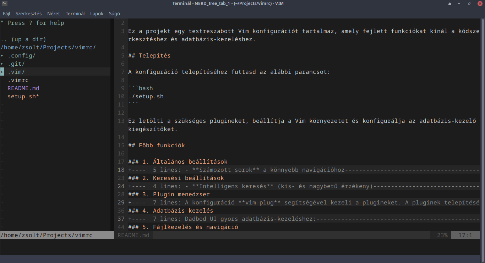
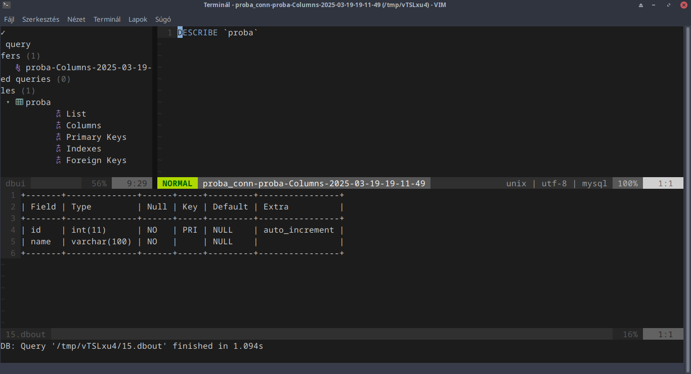

# Vim konfigurációs fájl és beállítások

Ez a projekt egy testreszabott Vim konfigurációt tartalmaz, amely fejlett funkciókat kínál a kódszerkesztéshez és adatbázis-kezeléshez.

## Telepítés

A konfiguráció telepítéséhez futtasd az alábbi parancsot:

```bash
./setup.sh
```

Ez letölti a szükséges plugineket, beállítja a Vim környezetet és konfigurálja az adatbázis-kezelő kiegészítőket.

## Főbb funkciók

### 1. Általános beállítások

- **Számozott sorok** a könnyebb navigációhoz
- **Szintaxis kiemelés** és sötét háttér támogatás
- **Automatikus behúzás** és fejlett fájlkezelés

### 2. Keresési beállítások

- **Intelligens keresés** (kis- és nagybetű érzékeny)
- **Valós idejű keresési eredmények kiemelése**

### 3. Plugin menedzser

A konfiguráció **vim-plug** segítségével kezeli a plugineket. A pluginek telepítéséhez nyisd meg a Vim-et és futtasd:

```vim
:PlugInstall
```

### 4. Adatbázis kezelés

Dadbod UI gyors adatbázis-kezeléshez:

- **`\db`** → DadBod UI megnyitása
- **`\df`** → Adatbázis fájlok keresése
- **`\dr`** → Adatbázis buffer átnevezése

### 5. Fájlkezelés és navigáció

- **NERDTree fájlkezelő** → `F2` megnyitja
- **NERDTree automatikusan bezár, ha az utolsó nyitott ablak**

### 6. Verziókezelés és Git integráció

- **Git változások követése** a bal oldali margón (gitgutter)
- **Git parancsok közvetlenül a Vim-ből (Fugitive plugin)**

### 7. Kódszerkesztési segédeszközök

- **Automatikus zárójel és idézőjel párosítás**
- **Kommentelés gyorsbillentyűvel** → `gcc`
- **Táblázat igazítása** → `:Tabularize /|`

### 8. Színsémák

Az alapértelmezett színséma: **Iceberg**. Ha módosítani szeretnéd, frissítsd a `.vimrc` fájlban a következő sort:

```vim
colorscheme iceberg
```

## További információk

A konfiguráció bármikor testreszabható a `.vimrc` fájl szerkesztésével. Ha kérdésed van, nyugodtan nyiss egy issue-t a GitHub-on!

## Képernyőképek





